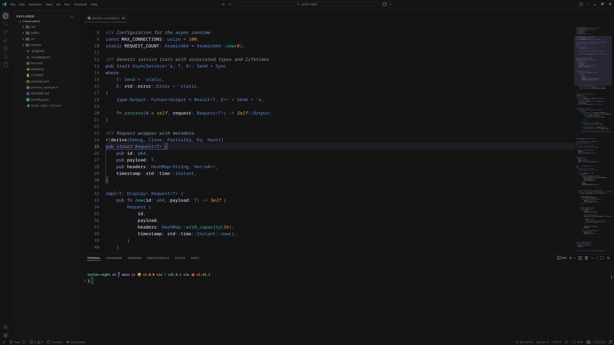

# Tyrian Night

A deep, ultra-saturated dark theme built on color science. Maximum depth and saturation within WCAG AA compliance.



## Features

- **WCAG AA compliant** — 12:1 main text contrast (AAA), 4.5–7:1 for all syntax tokens
- **Perceptually distinct colors** — every syntax category separated by CIEDE2000 ΔE > 12
- **True dark background** — `#0C0C0C` canvas, optimized for OLED and dim environments
- **Full semantic highlighting** — declared natively in the theme, no configuration needed
- **Universal language support** — Works with any language using TextMate grammars (JavaScript, Python, Rust, Go, etc.)
- **Optional Island UI layout** — rounded panels via [Custom UI Style](https://marketplace.visualstudio.com/items?itemName=subframe7536.custom-ui-style), consent-prompted on first run

## Installation

1. **Extensions** panel → search `Tyrian Night` → **Install**
2. **Ctrl+K Ctrl+T** → select **Tyrian Night**

## Island UI Layout (Optional)

Tyrian Night ships a CSS stylesheet for rounded, floating panels. It requires the [Custom UI Style](https://marketplace.visualstudio.com/items?itemName=subframe7536.custom-ui-style) extension.

1. Install **Custom UI Style**
2. Reload — Tyrian Night will prompt to enable the Island layout
3. Accept and reload again to apply

Decline the prompt to use the theme without layout modifications. The choice is stored and won't ask again.

> Based on [vscode-dark-islands](https://github.com/bwya77/vscode-dark-islands) by [bwya77](https://github.com/bwya77).

## Palette

| Role | Color | Hex |
|:-----|:------|:----|
| Background | Tyrian Canvas | `#0C0C0C` |
| Variables | Soft Lilac | `#D0C8E0` |
| Keywords | Amethyst Purple | `#8B6ABD` |
| Types | Deep Cobalt | `#5A78C0` |
| Functions | Bioluminescent Teal | `#3A9690` |
| Strings | Emerald | `#489060` |
| Numbers | Sovereign Gold | `#C09040` |
| Parameters | Orchid Pink | `#B068A0` |

## Contrast Ratios

| Token | Foreground | Ratio | Level |
|:------|:-----------|------:|:------|
| Main text | `#D0C8E0` | 12.13:1 | AAA |
| Keywords | `#8B6ABD` | 4.56:1 | AA |
| Types | `#5A78C0` | 4.55:1 | AA |
| Functions | `#3A9690` | 5.54:1 | AA |
| Strings | `#489060` | 5.06:1 | AA |
| Numbers | `#C09040` | 6.80:1 | AA |

UI chrome elements (line numbers, breadcrumbs) use lower contrast (~2.8:1) to reduce visual noise.

<details>
<summary><strong>Recommended Typography</strong> (optional settings)</summary>

```jsonc
{
  "editor.fontFamily": "'Monaspace Neon var', 'JetBrains Mono', 'IBM Plex Mono', monospace",
  "editor.fontSize": 15,
  "editor.fontWeight": "450",
  "editor.fontVariations": "'wdth' 95, 'slnt' 0, 'GRAD' -50",
  "editor.fontLigatures": "'calt', 'ss01', 'ss02', 'ss03', 'ss04', 'ss05', 'ss06', 'ss07', 'ss08', 'ss09', 'ss10', 'liga', dlig",
  "editor.lineHeight": 1.5,
  "editor.cursorBlinking": "smooth",
  "editor.cursorSmoothCaretAnimation": "on",
  "editor.smoothScrolling": true,
  // Terminal
  "terminal.integrated.fontFamily": "'Monaspace Neon var', 'IBM Plex Mono', monospace",
  "terminal.integrated.fontSize": 14,
  "terminal.integrated.lineHeight": 1.4
}
```

</details>

<details>
<summary><strong>Recommended Icon Theme</strong> (optional)</summary>

```jsonc
{
  "workbench.iconTheme": "vs-seti-folder"
}
```

The Seti icon theme complements the dark aesthetic with clean, recognizable file icons.

</details>

## Contributing

Found a language or scope that needs work? [Open an issue](https://github.com/renbkna/tyrian-night/issues).

## License

[Apache License 2.0](LICENSE) © [renbkna](https://github.com/renbkna)
