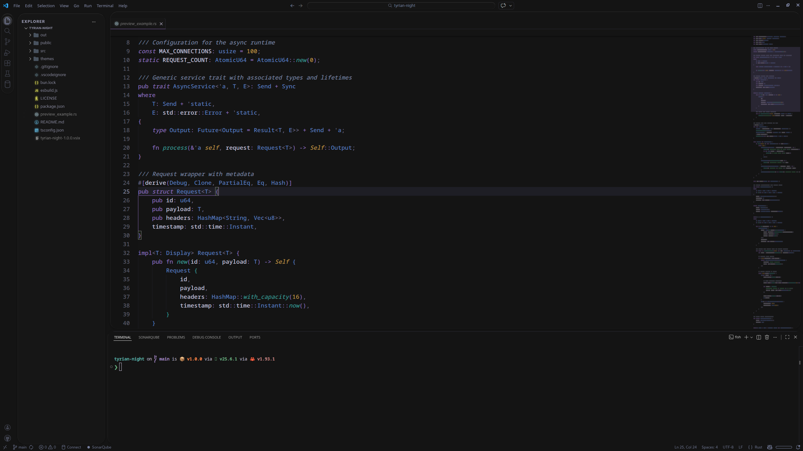

# Tyrian Night

A deep, ultra-saturated dark theme built on color science. Maximum depth and saturation within WCAG AA compliance.



## Features

- **WCAG AA compliant** — 12:1 main text contrast (AAA), 4.5–7:1 for all syntax tokens
- **Perceptually distinct colors** — every syntax category separated by CIEDE2000 ΔE > 12
- **True dark background** — `#0C0C0C` canvas, optimized for OLED and dim environments
- **Full semantic highlighting** — declared natively, no configuration needed
- **Universal language support** — works with any TextMate grammar
- **Built-in Island UI controls** — apply, repair, and restore the workbench patch without `Custom UI Style`

## Installation

1. **Extensions** panel → search `Tyrian Night` → **Install**
2. Use the first-run prompt, or **Ctrl+K Ctrl+T** → select **Tyrian Night**
3. If you want Island UI, run `Tyrian Night: Apply Island UI` and accept the restore-before-uninstall warning

> If you use Island UI, read the [uninstall warning](#island-ui) before enabling or removing it.

## Palette

| Role | Hex | Ratio | Level |
|:-----|:-----|------:|:------|
| Background (Tyrian Canvas) | `#0C0C0C` | — | — |
| Variables (Soft Lilac) | `#D0C8E0` | 12.13:1 | AAA |
| Keywords (Amethyst Purple) | `#8B6ABD` | 4.56:1 | AA |
| Types (Deep Cobalt) | `#5A78C0` | 4.55:1 | AA |
| Functions (Bioluminescent Teal) | `#3A9690` | 5.54:1 | AA |
| Strings (Emerald) | `#489060` | 5.06:1 | AA |
| Numbers (Sovereign Gold) | `#C09040` | 6.80:1 | AA |
| Parameters (Orchid Pink) | `#B068A0` | — | — |

UI chrome elements (line numbers, breadcrumbs) use lower contrast (~2.8:1) to reduce visual noise.

<details>
<summary><strong>Recommended Typography</strong></summary>

```jsonc
{
  "editor.fontFamily": "'Monaspace Neon var', 'JetBrains Mono', 'IBM Plex Mono', monospace",
  "editor.fontSize": 15,
  "editor.fontWeight": "450",
  "editor.fontVariations": "'wdth' 95, 'slnt' 0, 'GRAD' -50",
  "editor.fontLigatures": "'calt', 'ss01', 'ss02', 'ss03', 'ss04', 'ss05', 'ss06', 'ss07', 'ss08', 'ss09', 'ss10', 'liga', dlig",
  "editor.lineHeight": 1.5,
  "editor.cursorBlinking": "smooth",
  "editor.cursorSmoothCaretAnimation": "on",
  "editor.smoothScrolling": true,
  "terminal.integrated.fontFamily": "'Monaspace Neon var', 'IBM Plex Mono', monospace",
  "terminal.integrated.fontSize": 14,
  "terminal.integrated.lineHeight": 1.4
}
```

</details>

<details>
<summary><strong>Recommended Icon Theme</strong></summary>

```jsonc
{ "workbench.iconTheme": "vs-seti-folder" }
```

</details>

## Island UI

Tyrian Night ships its own Island UI installer — no external UI patching extension required.

When **Tyrian Night** is the active theme, the extension can install or repair Island UI. Switching away from the theme restores the stock VS Code shell.

> [!WARNING]
> If Island UI is active, you must run `Tyrian Night: Restore Classic UI` before uninstalling the extension. Uninstalling Tyrian Night does not remove the custom UI patch.

> [!WARNING]
> Do not click uninstall first. Restore the classic UI, reload VS Code, confirm the patch is gone, and only then uninstall the extension.

The patch surface is intentionally narrow: a single Tyrian stylesheet injected into `workbench.html`, one CSS asset copied into the workbench directory, and a matching `product.json` checksum update. Tyrian-owned backups sit next to patched files for reliable rollback, and a small user-level registry tracks managed app roots so `Restore Classic UI` can clean up completely.

**Required uninstall steps:**
1. Run `Tyrian Night: Restore Classic UI`.
2. Reload VS Code.
3. Confirm the custom UI is gone.
4. Uninstall the extension.

**Commands:**
`Tyrian Night: Apply Island UI` · `Repair Island UI` · `Restore Classic UI` · `Doctor Island UI`

**Doctor** classifies each managed app root as `clean`, `patched`, `managed-only`, `permission-denied`, `broken-backup`, or `checksum-mismatch`, and offers automatic repair when it finds self-healable state.

> Because Island UI patches `workbench.html`, VS Code may show *"Your installation appears to be corrupt"* while it is active. This is expected and does not indicate broken files.

> Based on [vscode-dark-islands](https://github.com/bwya77/vscode-dark-islands) by [bwya77](https://github.com/bwya77).

## Known Issues

After installing or updating Island UI, VS Code can occasionally restore open editor tabs with a temporary gap between the editor border and the tab row. Close all tabs and reload VS Code once to rebuild the layout.

## Contributing

Found a language or scope that needs work? [Open an issue](https://github.com/renbkna/tyrian-night/issues).

## License

[Apache License 2.0](LICENSE) © [renbkna](https://github.com/renbkna)
