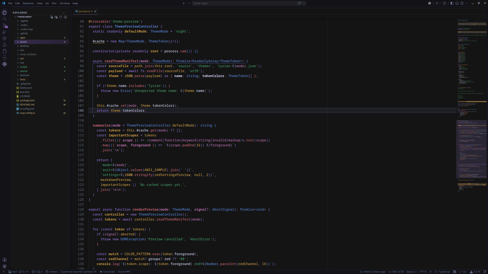

# Tyrian Night

A deep, ultra-saturated visual system built on color science and exported across editors, terminals, desktop shell colors, and the installable rice profile. Main editor text and syntax colors are tuned for WCAG AA contrast while quieter UI chrome stays intentionally lower contrast.



## Features

- **Single visual source** — `source/themes/` defines Tyrian Abyss, Night, Nocturne, Night Old, and Dawn for every consumer
- **WCAG AA tuned across the family** — Abyss, Night, Nocturne, Night Old, and Dawn keep AAA main text and AA syntax contrast
- **Perceptually distinct core palette** — advertised syntax roles are separated by CIEDE2000 ΔE > 12
- **True dark backgrounds** — Abyss starts at `#030207` and Night at `#0C0C0C`, optimized for OLED and dim environments
- **Full semantic highlighting** — declared natively, no configuration needed
- **Universal language support** — works with any TextMate grammar
- **Built-in Island UI controls** — apply, repair, and restore the workbench patch without `Custom UI Style`

## Repo Layout

This repo defines the Tyrian Night visual identity and exports it everywhere I use a computer.

- `source/` is the canonical theme source.
- `apps/vscode/` owns the VS Code extension runtime and Island UI assets.
- `apps/zed/` owns the Zed theme extension.
- `terminal/` owns Ghostty, fish, Starship, and Fastfetch outputs.
- `desktop/` owns KDE Plasma and Caelestia outputs.
- `rice/` owns the captured portable layout and wallpaper profile.
- `scripts/` owns generators, live install, and rice install logic.
- `assets/` owns shared preview/icon assets.

## VS Code Installation

1. **Extensions** panel → search `Tyrian Night` → **Install**
2. Use the first-run prompt, or **Ctrl+K Ctrl+T** → select **Tyrian Night**
3. If you want Island UI, run `Tyrian Night: Apply Island UI` and accept the restore-before-uninstall warning

> If you use Island UI, read the [uninstall warning](#island-ui) before enabling or removing it.

The source repo includes a [VS Code companion settings example](https://github.com/renbkna/tyrian-night/blob/main/apps/vscode/settings.example.json) for typography, editor chrome, terminal font, file nesting, language formatters, and Tyrian defaults.

## Palette

| Role | Hex | Ratio | Level |
|:-----|:-----|------:|:------|
| Background (Tyrian Canvas) | `#0C0C0C` | — | — |
| Active line (Reading Surface) | `#181820` | — | — |
| Variables (Soft Lilac) | `#D0C8E0` | 12.13:1 | AAA |
| Keywords (Amethyst Purple) | `#8D69C1` | 4.59:1 | AA |
| Types (Deep Cobalt) | `#5A78C0` | 4.55:1 | AA |
| Functions (Soft Crimson) | `#BA5E6B` | 4.57:1 | AA |
| Strings (Emerald) | `#489060` | 5.06:1 | AA |
| Numbers (Sovereign Gold) | `#C09040` | 6.80:1 | AA |
| Parameters (Orchid Pink) | `#B068A0` | 4.97:1 | AA |

UI chrome elements (line numbers, breadcrumbs) use lower contrast (~2.8:1) to reduce visual noise.
`Tyrian Nocturne` is the free redesign built around the active line as the real reading background.
`Tyrian Night Old` is included as a comparison preset with the previous keyword `#8B6ABD` and method `#3A9690` syntax palette.

<details>
<summary><strong>Recommended Typography</strong></summary>

```jsonc
{
  "editor.fontFamily": "'Monaspace Neon var', 'JetBrains Mono', 'IBM Plex Mono', monospace",
  "editor.fontSize": 15,
  "editor.fontWeight": "450",
  "editor.fontVariations": "'wdth' 95, 'slnt' 0, 'GRAD' -50",
  "editor.fontLigatures": "'calt', 'ss01', 'ss02', 'ss03', 'ss04', 'ss05', 'ss06', 'ss07', 'ss08', 'ss09', 'ss10', 'liga', dlig",
  "editor.lineHeight": 1.5,
  "editor.cursorBlinking": "smooth",
  "editor.cursorSmoothCaretAnimation": "on",
  "editor.smoothScrolling": true,
  "terminal.integrated.fontFamily": "'Monaspace Neon var', 'IBM Plex Mono', monospace",
  "terminal.integrated.fontSize": 14,
  "terminal.integrated.lineHeight": 1.4
}
```

Italic syntax is reserved for prose surfaces: comments, doc comments, notes, TODO-style annotations inside comments, and Markdown emphasis or quotes. Deprecated code is strikethrough only. When your editor or terminal can route italic text to a separate face, use `Monaspace Radon` as the italic/comment voice.

</details>

<details>
<summary><strong>Recommended Icon Theme</strong></summary>

```jsonc
{ "workbench.iconTheme": "vs-seti-folder" }
```

</details>

## Island UI

Tyrian Night ships its own Island UI supervisor — no external UI patching extension required.

When a Tyrian theme is active, the extension can install or repair Island UI. Switching away from the Tyrian theme family restores the stock VS Code shell. Apply and repair run through a preflight supervisor first: Tyrian checks the VS Code app root, current patch state, write access, backups, and checksum state before it attempts to mutate workbench files.

> [!WARNING]
> If Island UI is active, you must run `Tyrian Night: Restore Classic UI` before uninstalling the extension. Uninstalling Tyrian Night does not remove the custom UI patch.

> [!WARNING]
> Do not click uninstall first. Restore the classic UI, reload VS Code, confirm the patch is gone, and only then uninstall the extension.

The patch surface is intentionally narrow: a single Tyrian stylesheet injected into `workbench.html`, one CSS asset copied into the workbench directory, and a matching `product.json` checksum update. Tyrian-owned backups sit next to patched files for reliable rollback, and a v2 manifest receipt records the app root, patch strategy, upstream hashes, patched hashes, CSS hash, and owned sidecar names. A small user-level registry tracks managed app roots so `Restore Classic UI` can clean up completely. Restore trusts backup sidecars only when the manifest v2 restore proof is valid; old or incomplete Tyrian sidecars are cleaned by stripping the owned workbench block instead. If a VS Code package update resets the app tree or file permissions, Tyrian reports that as a repair state instead of failing with a raw filesystem error.

**Required uninstall steps:**

1. Run `Tyrian Night: Restore Classic UI`.
2. Reload VS Code.
3. Confirm the custom UI is gone.
4. Uninstall the extension.

**Commands:**
`Tyrian Night: Apply Island UI` · `Repair Island UI` · `Restore Classic UI` · `Doctor Island UI`

**Doctor** classifies each managed app root as `clean`, `patched`, `managed-only`, `missing`, `permission-denied`, `broken-backup`, or `checksum-mismatch`, reports desired state, VS Code version, workbench hashes, writeability, restore proof, the last manifest receipt, system write-access prompt availability, and the recommended action. Self-healable state is routed through `Restore Classic UI`; permission-required state is reported explicitly so the user knows the VS Code package install or update reset the writable patch surface.

For package-managed Linux installs, the preferred flow is a one-time scoped write-access unlock from inside the extension. When VS Code app files are not writable, Tyrian asks for system permission with `pkexec`, validates the current `workbench.html` and `product.json` hashes from the supervisor preflight, runs only the system `chown` and `chmod` tools for the workbench directory, `workbench.html`, and `product.json`, verifies the grant, and then retries the normal extension-owned apply or restore path. This does not run user-writable VSIX JavaScript as root, does not read project files, and does not send telemetry or network requests.

Restoring Classic UI removes Tyrian's workbench block, CSS, manifest, and backup sidecars. When a restore follows a Tyrian-triggered write-access unlock, Tyrian can ask system permission again to return the three VS Code app surfaces to root-owned package-style access (`0755` for the workbench directory, `0644` for `workbench.html` and `product.json`) after hash verification. If the system prompt is unavailable, the visual restore still removes the Island UI patch, and the next VS Code package update will usually reset package ownership.

Package maintainers can optionally install a root-owned broker fallback at `/usr/lib/tyrian-night/islandBroker.js` or `/usr/local/lib/tyrian-night/islandBroker.js`, with root-owned Island UI assets under `/usr/share/tyrian-night/vscode/island` or `/usr/local/share/tyrian-night/vscode/island`; the source is [apps/vscode/src/islandBroker.ts](apps/vscode/src/islandBroker.ts). That fallback is secondary to the standalone extension UX. Install it with `node scripts/installIslandBroker.mjs --apply` after `bun run build`, or use `node scripts/installIslandBroker.mjs` for a dry-run plan. Package updates may reset VS Code file ownership, in which case Tyrian will ask for the scoped unlock again. The VSIX excludes `out/islandBroker.js`.

> Because Island UI patches `workbench.html`, VS Code may show *"Your installation appears to be corrupt"* while it is active. This is expected and does not indicate broken files.

> Based on [vscode-dark-islands](https://github.com/bwya77/vscode-dark-islands) by [bwya77](https://github.com/bwya77).

## Terminal Companion Configs

Tyrian Night also ships repo-local companion configs for terminal tools:

- `terminal/ghostty/` controls terminal window colors and ANSI palette.
- `terminal/fish/` controls shell syntax and pager colors.
- `terminal/starship/` controls the prompt layout and prompt colors.
- `terminal/fastfetch/` controls the startup system summary.

These assets are generated from `source/themes/` so the Tyrian palette remains the source of truth.

## Desktop Companion Configs

Tyrian also owns desktop rice outputs:

- `desktop/kde/` contains generated KDE color schemes plus complete Tyrian Plasma desktop-theme and look-and-feel packages.
- `desktop/caelestia/` contains generated Caelestia scheme, state, and Hyprland color files.

These files keep Tyrian as the palette and rice source of truth while KDE and Caelestia only provide the runtime that loads the installed files.

For a local machine install, preview the live changes first:

```sh
node scripts/installLiveTyrian.mjs
```

Apply them with:

```sh
node scripts/installLiveTyrian.mjs --apply
```

The default install copies Tyrian-owned assets and generated configs into
`~/.local/share/tyrian-night/`, then writes the live terminal, KDE, and Caelestia config targets to use that installed copy.
Backups are written under `~/.local/state/tyrian-night/backups/`. After a normal install, the
cloned repo can be moved or deleted. Use `--link` only for local theme development when you want
live app files to follow edits inside the repo:

```sh
node scripts/installLiveTyrian.mjs --apply --link
```

## Tyrian Rice

The rice entrypoint installs the complete Tyrian setup:

- `terminal/ghostty/`, `terminal/fish/`, `terminal/starship/`, and `terminal/fastfetch/`
- KDE color scheme, Plasma desktop-theme skin, launcher/taskbar surfaces, lock-screen wallpaper, and Caelestia color state
- Plasma panel/widget layout from `rice/plasma-layout/`

The captured Plasma layout expects the widgets listed in
[`rice/plasma-layout/requirements.md`](rice/plasma-layout/requirements.md). Install those first on a
new machine if you want the widget layout to restore cleanly.

Preview the full rice install:

```sh
bun run rice
```

Apply the full rice on a machine:

```sh
bun run rice --apply
```

The default rice install is materialized the same way: `~/.local/share/tyrian-night/`
is the machine-local Tyrian source for terminal, desktop, wallpaper, lock-screen, fastfetch, and layout assets. The
repo remains the editable/generator source of truth; the installed copy is the machine-local
source used by live apps. Use `--link` only when this repo should remain the live source:

```sh
bun run rice --apply --link
```

The Plasma layout restore replaces `~/.config/plasma-org.kde.plasma.desktop-appletsrc` and `~/.config/plasmashellrc`, backs up the previous files under `~/.local/state/tyrian-night/backups/`, injects the current machine's active Plasma activity ID into desktop containments, restarts Plasma shell, and applies the wallpaper to the current desktops through `qdbus6`. The runtime activity and wallpaper steps are intentional because Plasma desktop containments are machine-local while the repo snapshot must stay portable and publishable.

Recapture the current machine layout after deliberate widget or wallpaper changes:

```sh
bun run rice --capture-layout
```

## Contributing

Found a language or scope that needs work? [Open an issue](https://github.com/renbkna/tyrian-night/issues).

## License

[Apache License 2.0](LICENSE) © [renbkna](https://github.com/renbkna)
